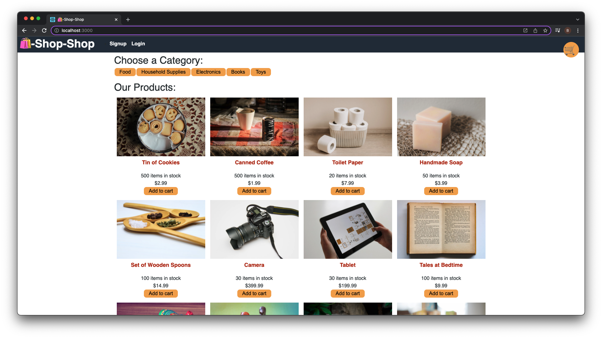

  # The Shop-Shop
  

  ## Description
  A hypothetical ecommerce site filled with placeholder data. Shoppers are able to add products to their cart and view all products and their detailed pages. However, users will need an account to checkout.

  ## Table of Contents
  * [Installation](#installation-instructions)
  * [Usage](#usage)
  * [Contributing](#contributing)
  * [Tests](#tests)
  * [Questions](#questions)
  
  
  

  ## Installation Instructions
  Navigate to [harvb-shop-shop]('https://github.com/harvbcoding/shop-shop)

  ## Usage
  Users are able to window shop and add products to their carts, but will need an account to checkout.

  
  ## Contributing
  I appreciate your interest in improving this project, however I am not accepting contributions at this time.
  

  
  ## Tests
  Screenshots of what the page should look like:
  

  ## Questions
  If you have any questions or need to report bugs please reach out to me at [HarvBCoding](https://www.github.com/HarvBCoding) or harvey.breania@gmail.com
  
  

